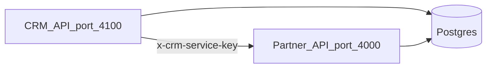

# Aidotics Bureau CRM

Backend for the Aidotics healthcare bureau CRM portal. Works alongside the **Partner app backend** (`Aidotics partner app/backend`) using one PostgreSQL database:

| Schema | Owner | Contents |
|--------|--------|----------|
| `public` | Partner API | `Worker`, `Job`, `Bureau`, `BureauMembership` |
| `crm` | CRM API | Staff auth, org profile, branches, billing, workforce links, audit |

## Architecture



Duty approval and partner membership sync go through Partner internal routes so notifications and Supabase sync stay centralized.

## Database (Supabase recommended for production)

Production: host Postgres on **Supabase**, API on **Render**, web on **Vercel**. See **[docs/SUPABASE.md](docs/SUPABASE.md)** for the `crm` schema, Storage buckets, and connection strings.

## Prerequisites

**Standalone CRM (typical local dev):** PostgreSQL + `DATABASE_URL` / `JWT_SECRET` for the CRM server only; partner app is optional unless you use duties/workforce sync or `PARTNER_SYNC_ON_REGISTER`.

**Full Aidotics stack:** Partner backend with `CRM_SERVICE_SECRET`, shared Postgres (`public` + `crm` schemas), Partner migration `20260527120000_bureau_crm` then CRM migration `20260527130000_init_crm`.

## Setup

### Partner backend

```bash
cd "../Aidotics partner app/backend"
cp .env.example .env   # set DATABASE_URL, JWT_SECRET, CRM_SERVICE_SECRET
npm install
npx prisma migrate deploy
npm run dev            # http://localhost:4000
```

### CRM server

```bash
cd server
cp .env.example .env   # set DATABASE_URL (?schema=crm), JWT_SECRET (required)
npm install
npx prisma migrate deploy
npm run db:seed
npm run dev            # http://localhost:4100 — keep this running while using the web app
```

For **partner-integrated** duties/workforce, set `PARTNER_API_URL` and `PARTNER_CRM_SERVICE_SECRET` to match the Partner backend. For **register-only CRM**, leave partner vars unset unless you set `PARTNER_SYNC_ON_REGISTER=true`.

### CRM web (frontend)

```bash
cd web
cp .env.example .env.local   # or keep the repo’s web/.env.local — sets API_URL for the proxy
npm install
npm run dev                   # http://localhost:3000
```

**You must run the CRM API and the web app together.** The browser calls `http://localhost:3000/api/v1/...`; Next rewrites that to `API_URL` (default `http://localhost:4100/v1/...`). If nothing is listening on **4100**, or `API_URL` is wrong, register/login show:

> “Could not reach the CRM API (proxy returned an error page)…”

Fix: start **`cd server && npm run dev`**, confirm `curl -s http://127.0.0.1:4100/health` returns JSON, set **`web/.env.local`** to `API_URL=http://127.0.0.1:4100`, then **restart** `npm run dev` in `web/`.

Register does **not** call the partner API unless you set **`PARTNER_SYNC_ON_REGISTER=true`** on the server (see `server/.env.example`).

Link from your marketing site: `{CRM_WEB_URL}` → e.g. `http://localhost:3000` or production CRM domain.

### Vercel (frontend only)

**Important:** set the project **Root Directory** to **`web`**. Deploying the repo root causes **404: NOT_FOUND** on `*.vercel.app`. See [docs/VERCEL.md](docs/VERCEL.md).

Set **`API_URL`** in Vercel to your hosted CRM API (`server/`), not `localhost`.

Routes:
- `/register` — create bureau account
- `/login` — sign in
- `/onboarding` — 17-step wizard (matches design screens)
- `/dashboard` — post-onboarding home (stub)

## Environment variables

| Variable | Service | Description |
|----------|---------|-------------|
| `DATABASE_URL` | Both | Postgres connection string |
| `JWT_SECRET` | Both | Partner worker JWT / CRM staff JWT (different `typ` claim) |
| `CRM_SERVICE_SECRET` | Partner | Enables `/internal/crm/*` |
| `PARTNER_CRM_SERVICE_SECRET` | CRM | Same value as Partner |
| `PARTNER_API_URL` | CRM | e.g. `http://localhost:4000` |
| `CRM_WEB_URL` | CRM | Public CRM web URL for website buttons & onboarding links |

## Phase 1 API index (`/v1`)

### Auth
- `POST /auth/register` — create bureau + admin user
- `POST /auth/login`
- `POST /auth/refresh`
- `POST /auth/logout`
- `POST /auth/verify-otp`
- `POST /auth/forgot-password`
- `POST /auth/send-verify-otp`
- `GET /auth/me`

### Bureau & org
- `GET /bureau` · `PATCH /bureau`
- `GET|POST|PATCH|DELETE /branches`
- `GET|POST|PATCH /billing/setup` · `POST /billing/bank-accounts`
- `GET|POST|PATCH /payments/setup`

### Team & RBAC
- `POST /team/invite` · `GET|PATCH|DELETE /team`
- `GET|POST|PATCH /roles` · `GET /roles/permissions`

### Workforce
- `GET|POST|PATCH /workforce`
- `POST /workforce/resolve-mobiles`
- `GET /workforce/partner-memberships`
- `POST /workforce/import/validate` · `POST /workforce/import/process` · `GET /workforce/import/history`

### KYC & files
- `GET /verification/status`
- `POST /verification/pan|gst|aadhaar|upload-document`
- `POST /files/upload` · `DELETE /files/:id`

### Duties (via Partner)
- `GET /duties`
- `POST /duties/:jobId/approve`
- `POST /duties/:jobId/reject-acceptance`

### Onboarding wizard (17 steps — matches UI screens)
- `GET /onboarding/steps` (public step list)
- `GET /onboarding` · `GET /onboarding/:stepSlug`
- `PUT /onboarding/:stepSlug/draft` · `POST /onboarding/:stepSlug/complete`
- See [docs/ONBOARDING.md](docs/ONBOARDING.md) for order, slugs, and website deep links

### Setup & audit
- `GET /setup/progress` · `POST /setup/complete`
- `GET|POST /workflow/preferences`
- `GET /audit`

## Partner internal API (`/internal/crm`)

Requires header `x-crm-service-key: <CRM_SERVICE_SECRET>`.

- `POST /internal/crm/bureaus`
- `GET /internal/crm/bureaus/:bureauId/jobs`
- `POST /internal/crm/bureaus/:bureauId/jobs/:jobId/approve`
- `POST /internal/crm/bureaus/:bureauId/jobs/:jobId/reject-acceptance`
- `POST /internal/crm/workforce/resolve-mobiles`
- `GET /internal/crm/bureaus/:bureauId/workers/:workerId`
- `POST|GET /internal/crm/bureaus/:bureauId/memberships`

## Register example

```bash
curl -X POST http://localhost:4100/v1/auth/register \
  -H "Content-Type: application/json" \
  -d '{
    "bureauCode": "DELHI-NCR-01",
    "bureauName": "Demo Care Bureau",
    "email": "admin@demo-bureau.test",
    "password": "ChangeMe123!",
    "fullName": "Bureau Admin"
  }'
```

## Notes

- Partners remain central: duties execute in the Partner app; CRM coordinates roster and bureau-scoped approvals.
- A worker can belong to **multiple bureaus** via `BureauMembership`.
- Ops console can set `bureauId` when creating duties for bureau-routed jobs.
