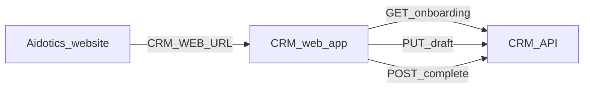

# Bureau CRM — Onboarding wizard (17 steps)

Use this order in the CRM web app. Your **main Aidotics website** can link a button to the CRM (set `CRM_WEB_URL` in server `.env`).

Suggested website links:

| Button label | Target |
|--------------|--------|
| Open Bureau CRM | `{CRM_WEB_URL}` |
| Start onboarding | `{CRM_WEB_URL}/onboarding` |
| Resume setup | `{CRM_WEB_URL}/onboarding?step={slug}` |

---

## Step order (fixed)

| # | Slug | Screen title | Screenshots / notes |
|---|------|--------------|---------------------|
| 1 | `bureau_profile` | Bureau Profile | Legal name, display name, logo, service types, cities, owner contact |
| 2 | `kyc_verification` | KYC & Verification | Ownership, PAN/GST, address, signatory, incorporation |
| 3 | `branch_billing` | Branch & Billing Setup | Branch table + invoice/GST settings |
| 4 | `payment_collection` | Payment Collection Setup | UPI, QR, bank, toggles, advance % |
| 5 | `operating_style` | Operating Style Setup | Business model, structure, coverage, working hours |
| 6 | `duty_operations` | Duty Operations Preferences | Duty types, approval rules, broadcast, SLA timers |
| 7 | `responsibility_automation` | Responsibility Automation | Process → role map, automation toggles, escalation |
| 8 | `staff_skill_matrix` | Staff Skill Matrix | Skills / certifications (Phase 2 UI) |
| 9 | `workforce_setup` | Workforce Setup | Partner roster, CSV import |
| 10 | `digital_identity` | Digital Identity System | QR / bureau ID (Phase 2 UI) |
| 11 | `team_roles` | Team Structure & Roles | Invites, branch assignment |
| 12 | `permission_matrix` | Permission Matrix | Role permissions |
| 13 | `partner_network` | Partner Network Integration | Aidotics network |
| 14 | `workflow_builder` | Workflow Builder | Advanced workflows (Phase 2) |
| 15 | `public_profile` | Public Bureau Profile | SEO / public listing (Phase 2) |
| 16 | `subscription` | Subscription Setup | Aidotics CRM plan (Phase 2) |
| 17 | `crm_ready` | CRM Ready | Final review & go live |

---

## API (`/v1/onboarding`)

**Public (no auth)**

- `GET /v1/onboarding/steps` — ordered step list + `crmWebUrl`

**Authenticated** (`Authorization: Bearer …`)

- `GET /v1/onboarding` — full state: `currentStep`, per-step `status`, `isAccessible`, drafts flags
- `GET /v1/onboarding/:stepSlug` — draft payload for one step
- `PUT /v1/onboarding/:stepSlug/draft` — body `{ "data": { ... } }`
- `POST /v1/onboarding/:stepSlug/save-draft` — alias for save without advancing
- `POST /v1/onboarding/:stepSlug/complete` — mark step done; advances `currentStep`
- `POST /v1/onboarding/go-to/:stepOrder` — navigate back/forward within allowed range

Legacy: `GET /v1/setup/progress` still works; prefer `/v1/onboarding`.

---

## Frontend flow



1. User registers via `POST /v1/auth/register` (or login).
2. Load `GET /v1/onboarding` → render sidebar from `steps[]` in order.
3. On **Save as Draft**: `PUT /v1/onboarding/{slug}/draft`.
4. On **Continue**: persist draft (optional) + `POST /v1/onboarding/{slug}/complete`.
5. Steps 1–4 can also call structured APIs (`/bureau`, `/branches`, `/billing`, `/payments`) when you normalize data; until then, store full form JSON in `stepDrafts`.

---

## Step status values

| Status | Meaning |
|--------|---------|
| `pending` | Not started |
| `draft` | Saved but not completed |
| `completed` | User clicked Continue on that step |

---

## Environment

```bash
CRM_WEB_URL=https://crm.aidotics.com   # shown in GET /v1/onboarding
```
